<p align="center">
  
</p>

<h1 align="center">Nali CLI</h1>

<p align="center">:anchor: Parse info of IP Address or CDN's CNAME without leaving your terminal</p>

<p align="center">
<a href="https://skk.moe"></a>
<a href="https://github.com/fantasyroot"></a>
<a href="https://www.npmjs.com/package/nali-cli"></a>


</p>

## Feature
- [x] Query IP Address or CDN's CNAME online.
- [x] Cache for duplicate IP information.
- [x] Allows to select query server from multiple servers, and remember.
- [x] Used with other commands, receives standard output as a pipe, convert the IP address in it.

## Installation

```bash
yarn global add nali-cli
# npm install nali-cli -g
```

> Prebuilt binaries is also available under the [`bin`](https://github.com/SukkaW/nali-cli/tree/master/bin) directory of the GitHub Repo.

## Usage

Query a simple IP address:

```
$ nali 1.145.1.4

1.145.1.4 [澳大利亚 墨尔本 Telstra]
```

Query IP addresses:

```
$ nali 114.5.1.4 191.919.8.10 1.0.0.1

114.5.1.4 [印度尼西亚] 191.919.8.10 1.0.0.1 [美国 APNIC&CloudFlare 公共 DNS 服务器]
```

Query and parse IP addresses, CNAME from `stdin`:

```
$ dig blog.skk.moe +short | nali

104.18.101.28 [美国 CloudFlare 公司 CDN 节点]
104.18.100.28 [美国 CloudFlare 公司 CDN 节点]


$ nslookup www.gov.cn 1.0.0.1 | nali
Server:		1.0.0.1 [美国 APNIC&CloudFlare 公共 DNS 服务器]
Address:	1.0.0.1 [美国 APNIC&CloudFlare 公共 DNS 服务器]#53

Non-authoritative answer:
www.gov.cn	canonical name = www.gov.cn.bsgslb.cn. [白山云 CDN]
www.gov.cn.bsgslb.cn [白山云 CDN]	canonical name = zgovweb.v.bsgslb.cn. [白山云 CDN]
Name:	zgovweb.v.bsgslb.cn [白山云 CDN]
Address: 107.155.25.117 [香港 Zenlayer]
Name:	zgovweb.v.bsgslb.cn [白山云 CDN]
Address: 107.155.25.118 [香港 Zenlayer]
Name:	zgovweb.v.bsgslb.cn [白山云 CDN]
Address: 107.155.25.116 [香港 Zenlayer]
Name:	zgovweb.v.bsgslb.cn [白山云 CDN]
Address: 107.155.25.120 [香港 Zenlayer]
Name:	zgovweb.v.bsgslb.cn [白山云 CDN]
Address: 2001:438:fffd:98::4
Name:	zgovweb.v.bsgslb.cn [白山云 CDN]
Address: 2001:438:fffd:98::5
```

Use Nali CLI built-in tools:

```
$ nali-nslookup blog.skk.moe

Server:         1.0.0.1 [美国 APNIC&CloudFlare 公共 DNS 服务器]
Address:        1.0.0.1 [美国 APNIC&CloudFlare 公共 DNS 服务器]#53

Non-authoritative answer:
Name:   blog.skk.moe
Address: 104.18.101.28 [美国 CloudFlare 公司 CDN 节点]
Name:   blog.skk.moe
Address: 104.18.100.28 [美国 CloudFlare 公司 CDN 节点]
Name:   blog.skk.moe
Address: 2606:4700::6812:641c
Name:   blog.skk.moe
Address: 2606:4700::6812:651c


$ dig cdn.jsdelivr.net @1.0.0.1 +short

cdn.jsdelivr.net.cdn.cloudflare.net. [Cloudflare]
104.16.89.20 [美国 CloudFlare 公司 CDN 节点]
104.16.88.20 [美国 CloudFlare 公司 CDN 节点]
104.16.85.20 [美国 CloudFlare 公司 CDN 节点]
104.16.87.20 [美国 CloudFlare 公司 CDN 节点]
104.16.86.20 [美国 CloudFlare 公司 CDN 节点]
```

> Nali CLI has built-in tools:
>
> - `nali-dig`
> - `nali-nslookup`
> - `nali-ping`
> - `nali-tracepath`
> - `nali-traceroute`
>
> Nali required related software installed. For example, in order to use `nali-dig` and `nali-nslookup` you need to have bind (dnsutils) installed.

Change Query Server:

```
nali server

# View the current query server
nali server -c

# Change query server to default
nali server -d
```

## Interface

```
$ nali --help

Usage: nali <command> [options]

Options:
  -v, --version  版本信息
  -h, --help     output usage information

Commands:
  parse          解析 stdin 或参数中的 IP 信息 (默认)
  server         更改 IP 查询服务器
  help [cmd]     display help for [cmd]
```

## Related

- [Nali](https://github.com/SukkaW/Nali) Oringinal Nali CLI, written in C & Perl
- [Commander.js](https://github.com/tj/commander.js) Node.js command-line interfaces made easy
- [SukkaLab/cdn](https://lab.skk.moe/cdn) A CDN CNAME Data

## Author

**Nali CLI** © [Sukka](https://github.com/SukkaW), Released under the [GPL-3.0](./LICENSE) License.<br>
Authored and maintained by Sukka with help from contributors ([list](https://github.com/SukkaW/nali-cli/graphs/contributors)).

> [Personal Website](https://skk.moe) · [Blog](https://blog.skk.moe) · GitHub [@SukkaW](https://github.com/SukkaW) · Telegram Channel [@SukkaChannel](https://t.me/SukkaChannel) · Twitter [@isukkaw](https://twitter.com/isukkaw) · Keybase [@sukka](https://keybase.io/sukka)
